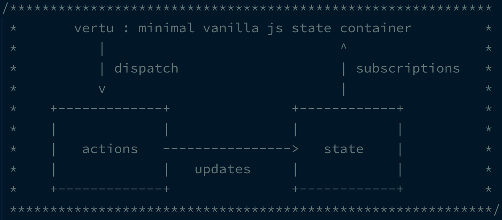

[](https://unpkg.com/vertu)
[](https://unpkg.com/vertu)
[](https://opensource.org/licenses/MIT)

<details>
<summary><strong>Installation</strong></summary>

Install it from NPM:

```bash
yarn add vertu
```

then, use in your application with a module bundler like webpack or parcel:

```js
import { store, dispatch } from 'vertu'
```

Alternatively, you can grab a copy from UNPKG CDN:

```html
<script src="https://unpkg.com/vertu" />
```

Want a UMD build from UNPKG CDN?

```html
<script src="https://unpkg.com/vertu/vertu.js" />
```

</details>

### Usage

Initialize a store with default state and actions

```js
import { store, dispatch } from 'vertu'

store.init(
	{ count: 10 }, // default state
	{
		// actions can just return updated state
		down(state) {
			return { count: state.count - 1 }
		},
		// use arrow functions to define action
		up: state => ({ count: state.count + 1 }),
		// action receives current state as first argument and other parameters next
		upBy: (state, by) => ({ count: state.count + by }),
	},
)

// dispatch an action
dispatch('down')

// dispatch an action with arguments
dispatch('upBy', 5)
```

Above example assumes a global state and actions container. However, actions can also be defined outside the state container. For example:

```js
const upByFive = state => ({ count: state.count + 5 })

dispatch(upByFive)
```

For extreme rare cases, you can use `update` function to update the state directly without dispatching an action. For example:

```js
update('MANUAL', { count: 100 })
```

### Async actions

`vertu` has built in support to dispatch an async action. The state values will be shallow merged with the result of promise resolution. For example:

```js
const fetchTodos = state =>
	fetch('https://jsonplaceholder.typicode.com/todos')
		.then(response => response.json())
		.then(todos => ({ todos })) // api response goes in state.todos

dispatch(fetchTodos) // state will have `state.todos` after promise is resolved
```

### Subscriptions

An application can subscribe to state changes using subscriptions API. For example:

```js
store.on((state, actionName) => console.log(`new state after ${actionName}: `, state))
```

> a subscription gets called every time the state changes.

### License

**vertu** is licensed under the [MIT License](http://opensource.org/licenses/MIT).<br>
Documentation is licensed under [Creative Common License](http://creativecommons.org/licenses/by/4.0/).<br>
Created with ♥ by [@osdevisnot](https://github.com/osdevisnot) and [all contributors](https://github.com/vertu/graphs/contributors).
