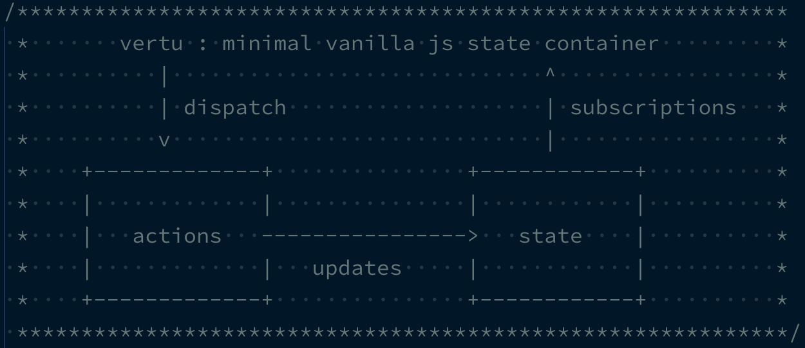
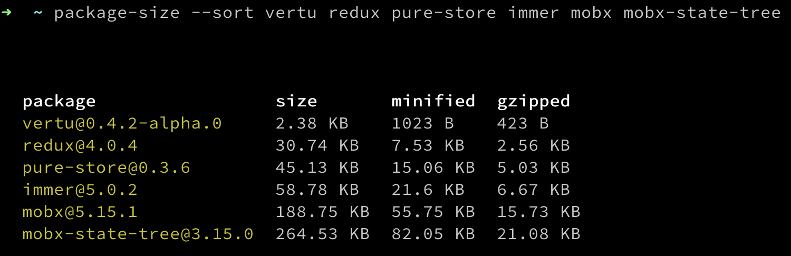
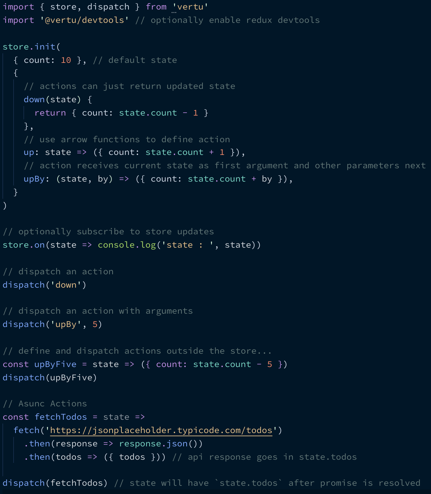
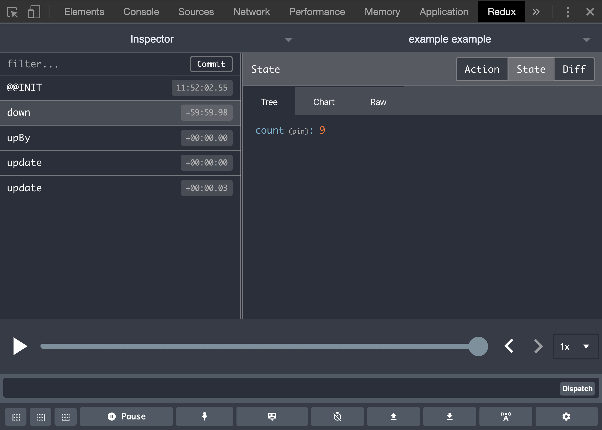

[](https://unpkg.com/vertu)
[](https://unpkg.com/vertu)
[](https://travis-ci.org/osdevisnot/vertu)
[](https://coveralls.io/github/osdevisnot/vertu?branch=master)
[](https://opensource.org/licenses/MIT)

## :sparkles: Features

- **Small Footprint** (less than 300 B min + gzip), optimal for 3G connections.
- **No Framework** - use it standalone, or with your favourite view library.
- **Familier** - ideas and concepts from redux like libraries.
- **Best DX** - with Redux Devtools Integration.
- **Inline Actions** - define actions on the go.
- **Seamless Async Actions** - using [Promise](https://developer.mozilla.org/en-US/docs/Web/JavaScript/Reference/Global_Objects/Promise) or [async/await](https://javascript.info/async-await) for actions.
- **No Boilerplate** - All the benifits of _Redux_ without the _ceremony_.

## :grey_question: Motivation

- As much as I love `redux` as a pattern, the ceremony and boilerplate around state management is often overwhelming. I wanted to create a solution that provides tools and techniques to organize application data without enforcing strict architechure and methodology.
- I also wanted this solution to be as light weight as possible. See size comparison with some of the existing solutions:



## :boom: API Overview



## Installation

Install it from NPM:

```bash
yarn add vertu
```

then, use in your application with a module bundler like webpack or parcel:

```js
import { store, dispatch } from 'vertu'
```

Alternatively, you can grab a copy from UNPKG CDN:

```html
<script src="https://unpkg.com/vertu" />
```

Want a UMD build from UNPKG CDN?

```html
<script src="https://unpkg.com/vertu/vertu.js" />
```

## :plate_with_cutlery: Usage

Initialize state and actions and use dispatch to fire the actions.

```js
import { store, dispatch } from 'vertu'
import 'vertu/dist/devtools' // optionally enable redux devtools

store.init(
  { count: 10 }, // default state
  {
    // actions can just return updated state
    down(state) {
      return { count: state.count - 1 }
    },
    // use arrow functions to define action
    up: state => ({ count: state.count + 1 }),
    // action receives current state as first argument and other parameters next
    upBy: (state, by) => ({ count: state.count + by }),
  }
)

// optionally subscribe to store updates
store.on(state => console.log('state : ', state))

// dispatch an action
dispatch('down')

// dispatch an action with arguments
dispatch('upBy', 5)
```

Above example assumes a global state and actions container. However, actions can also be defined outside the state container. For example:

```js
const upByFive = state => ({ count: state.count + 5 })

dispatch(upByFive)
```

For extreme rare cases, you can use `update` function to update the state directly without dispatching an action. For example:

```js
update('MANUAL', { count: 100 })
```

> NB: Using `update` is generally discouraged. The export mainly serves `devtools`.

## :muscle: Async actions

`vertu` has built in support to dispatch an async action. The state values will be shallow merged with the result of promise resolution. For example:

```js
const fetchTodos = state =>
  fetch('https://jsonplaceholder.typicode.com/todos')
    .then(response => response.json())
    .then(todos => ({ todos })) // api response goes in state.todos

dispatch(fetchTodos) // state will have `state.todos` after promise is resolved
```

## :telescope: Subscriptions

An application can subscribe to state changes using subscriptions API. For example:

```js
store.on((state, actionName) =>
  console.log(`new state after ${actionName}: `, state)
)
```

> a subscription gets called every time the state changes.

## :trophy: Devtools

To use [redux-devtools-extension](https://github.com/zalmoxisus/redux-devtools-extension) with `vertu`, make sure you have the devtools extension installed.

Your code also needs to import `vertu/dist/devtools` to enable devtools support for the project.

```js
import { store, dispatch, update } from 'vertu'
import 'vertu/dist/devtools' // enable the devtools support

store.init() ...
```



## :clinking_glasses: License

**vertu** is licensed under the [MIT License](http://opensource.org/licenses/MIT).<br>
Documentation is licensed under [Creative Common License](http://creativecommons.org/licenses/by/4.0/).<br>
Created with ♥ by [@osdevisnot](https://github.com/osdevisnot) and [all contributors](https://github.com/vertu/graphs/contributors).
